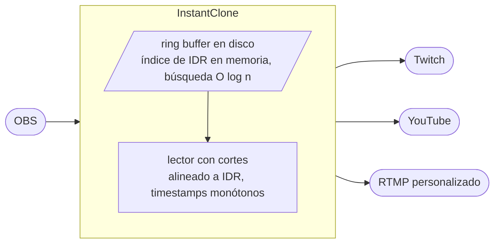

<div align="center">

<sub><a href="README.md">English</a> &nbsp;·&nbsp; <b>Español</b></sub>

<br/>
<br/>


<br/>

<a href="#instalación"></a>
<a href="#cómo-funciona"></a>
<a href="#configuración-de-obs"></a>
<a href="#control-http"></a>

<br/>
<br/>

<a href="https://github.com/Soulhackzlol/InstantClone/actions/workflows/ci.yml"></a>
<a href="https://github.com/Soulhackzlol/InstantClone/releases"></a>
<a href="LICENSE"></a>


</div>

<br/>

<div align="center"></div>

<table>
<tr>
<td valign="top" width="62%">

## Por qué

Quería poner delay en mi propio directo y me puse a buscar. La opción más cuidada que encontré fue [InstantDelay](https://instant-delay.com/), que es de pago. Prefería tener algo que pudiera construir desde cero, entender de punta a punta y adaptar a mi setup, así que escribí esto.

Cuando ya lo tenía hecho, las piezas que de verdad quería eran: una activación en dos fases (para que el momento de salir al aire con delay sea imperceptible en el reproductor del destino), varios destinos simultáneos, un dock para OBS y un overlay de estadísticas que se mete como browser-source.

<sub>InstantClone es un proyecto independiente, sin afiliación ni respaldo de InstantDelay ni de sus desarrolladores.</sub>

</td>
<td valign="top" width="38%">

<table>
<tr><td><b>Binario</b></td><td align="right"><code>1.2 MB</code></td></tr>
<tr><td><b>RSS inactivo</b></td><td align="right"><code>~9 MB</code></td></tr>
<tr><td><b>Hilos</b></td><td align="right"><code>1 tokio + 1 bandeja</code></td></tr>
<tr><td><b>Deps en runtime</b></td><td align="right"><code>tokio, bytes, ureq</code></td></tr>
<tr><td><b>Tests</b></td><td align="right"><code>86 / 86</code></td></tr>
</table>

</td>
</tr>
</table>

<br/>

<div align="center"></div>

## Cómo funciona

<div align="center">

</div>

<br/>

<table>
<tr>
<td valign="top" width="50%">

**Dos fases por diseño.** **Armas** un buffer (tamaño en segundos). InstantClone empieza a rellenarlo desde el feed de OBS sin afectar todavía a lo que sale al aire. Cuando está lleno pasa de <kbd>BUFFERING</kbd> a <kbd>ARMED</kbd> y pulsas **Activar** cuando quieras. La transición es instantánea en pantalla: el lector cambia de la cola en vivo a una posición N segundos atrás.

</td>
<td valign="top" width="50%">

**Cortar es el mismo truco al revés.** Pulsas **Cortar**, el lector busca el IDR más cercano a la cola en vivo, reescribe los timestamps para que sigan siendo monótonos desde donde el reproductor del destino piensa que está el "ahora", y reanuda. Sin reconexión, sin nuevo handshake.

</td>
</tr>
</table>



> [!NOTE]
> El buffer vive en disco por defecto (`./instantclone.buf`, 300 MB ≈ 7 minutos a 6 Mbps), fuera de RAM porque puede llegar a varios cientos de MB. Lo único en RAM es el índice de IDR, alrededor de 1 MB para 10 minutos a 60 fps. El archivo se borra al cerrar la app de forma limpia, así que no se acumula entre sesiones.

<br/>

<div align="center"></div>

## Instalación

```text
1.  Descarga instantclone.exe
2.  Doble clic
3.  El panel se abre en http://127.0.0.1:7799
```

Ya está. Mientras corre se queda un icono en la bandeja del sistema. Clic derecho para abrir el panel, el dock de OBS, un **Cortar delay** al vuelo, o **Quit**. Cerrar la pestaña del navegador no mata el proxy; solo Quit lo hace.

> [!IMPORTANT]
> El Firewall de Windows preguntará en el primer arranque porque el proxy escucha en <kbd>:1935</kbd> (RTMP) y <kbd>:7799</kbd> (web). Permítelo solo en **Redes privadas**.

> [!WARNING]
> Solo Windows 10/11. macOS y Linux no están soportados, no están probados y no están empaquetados.

<br/>

<div align="center"></div>

## Configuración de OBS

<table>
<tr>
<td valign="top" width="58%">

En OBS, ve a **Ajustes → Emisión** y cambia:

```diff
- Servicio:   Twitch (o lo que tuvieras)
- Servidor:   auto
- Stream Key: <tu clave real>
+ Servicio:   Personalizado
+ Servidor:   rtmp://127.0.0.1:1935/live
+ Stream Key: live
```

Pulsa **Iniciar transmisión**. La cápsula OBS de InstantClone se pone verde. Tus claves reales de Twitch/YouTube/Kick van en la pestaña **Destinos** de InstantClone, no en OBS. OBS solo habla con InstantClone.
Seguramente desaparezca tu chat de twitch en OBS porque OBS detecta que no "vas a transmitir en Twitch", añade el panel manualmente.
</td>
<td valign="top" width="42%">

<table>
<tr><td align="center" width="40"><b>1</b></td><td>Pon un delay (p. ej. <kbd>15</kbd>s) → <b>Armar</b>.</td></tr>
<tr><td align="center"><b>2</b></td><td>Mira cómo se llena el buffer. Cuando indique <kbd>ARMED</kbd>, pulsa <b>Activar</b>.</td></tr>
<tr><td align="center"><b>3</b></td><td><b>Cortar delay</b> cuando quieras para volver al directo.</td></tr>
</table>

> [!TIP]
> Haz fan-out de un único feed de OBS a varios destinos a la vez. Añade Twitch, YouTube y un endpoint RTMP personalizado, activa cada uno por separado y mira su bitrate en vivo por destino.

</td>
</tr>
</table>

<br/>

<div align="center"></div>

## Dock y overlays

<table>
<tr>
<td valign="top" width="40%">


</td>
<td valign="top" width="60%">

### Dock de OBS

Añade un browser-dock personalizado en OBS apuntando a:

<pre><code>http://127.0.0.1:7799/dock</code></pre>

Un panel de 280×340 con el indicador, los controles de armar/activar/desarmar/cortar y el estado en vivo. Vive dentro de OBS para no cambiar de pestaña en mitad de una partida.

### Overlays como browser-source

Mete uno como browser-source para mostrar el delay en directo:

<pre><code>http://127.0.0.1:7799/overlay?style=corner&amp;lang=es</code></pre>

<sub><b>Estilos</b></sub> &nbsp;`minimal` · `corner` · `strip` · `focus` · `broadcast` · `ticker`

<sub><b>Idiomas</b></sub> &nbsp;`en` · `es` · `pt` · `fr` · `de`

Suelta cualquier `.html` en `./overlays/` y se sirve en `/overlay/tu-archivo.html`.

</td>
</tr>
</table>

<br/>

<div align="center"></div>

## Control HTTP

<table>
<tr>
<td valign="top" width="62%">

| | Endpoint | Cuerpo | Acción |
|:---|---|---|---|
| <kbd>POST</kbd> | `/arm` | `ms=15000` | Empieza a llenar un buffer de 15 s. No sale al aire todavía. |
| <kbd>POST</kbd> | `/activate` | | Activa el delay armado. <kbd>409</kbd> si el buffer no está listo. |
| <kbd>POST</kbd> | `/disarm` | | Cancela el armado. Descarta el buffer sin salir al aire. |
| <kbd>POST</kbd> | `/stop` | | Corta el delay y vuelve al directo. |
| <kbd>POST</kbd> | `/delay` | `ms=NNN` | Atajo: arma y activa en cuanto esté listo. |
| <kbd>GET</kbd> | `/state` | | JSON instantáneo del estado. |
| <kbd>GET</kbd> | `/events` | | Flujo SSE del JSON de estado, solo push. |

</td>
<td valign="top" width="38%">

<br/>

**Receta Stream Deck**

La acción **Web Request** habla POST form-encoded por defecto.

```text
URL:    http://127.0.0.1:7799/arm
Método: POST
Cuerpo: ms=15000
```

Armado de un botón. Añade `/activate` y `/stop` a un segundo y tercer botón y tienes control completo del delay desde tu deck.

</td>
</tr>
</table>

<details>
<summary>Respuesta de ejemplo de <code>/state</code></summary>

```json
{
  "phase": "active",
  "armed_delay_ms": 15000,
  "current_delay_ms": 15040,
  "buffer_fill_ms": 15000,
  "ingest_alive": true,
  "egress_alive": true,
  "destinations_alive": 2,
  "destinations_total": 3,
  "bitrate_kbps": 6020,
  "stats": { "tags_sent": 184302, "bytes_sent": 1338294104, "cuts": 1 }
}
```

</details>

<br/>

<div align="center"></div>

## Compilar

Rust 1.74+ estable.

```powershell
git clone <repo>
cd instantclone
cargo build --release
.\target\release\instantclone.exe
```

Sin npm, sin submódulos, sin SDK de plataforma. El HTML del panel se minifica y comprime con gzip en tiempo de compilación desde `build.rs` (usa `flate2`, solo build-dep) y se embebe en el binario; en runtime se sirve con `Content-Encoding: gzip`.

`cargo test --release` cubre la máquina de estados (`arm → preparing → ready → active → cut`), detección de IDR en AVC + Enhanced RTMP, codec AMF0 + guardia de recursión, round-trip de settings, evicción del ring-buffer con protección de lecturas en vuelo, parsing HTTP, política CSRF, pre-flight de puertos y la negociación de contenido `accepts_gzip`. 86 tests, todos en verde.

<br/>

<div align="center"></div>

## Estado

**Listo para uso diario en Windows.** Lo uso en mis propios directos. CI corre fmt + clippy (con `-D warnings`) + 86 tests en cada push, y un tag dispara la build + publicación automática de la release.

**Lo que está sólido**

- La máquina de estados `arm → activate → cut` en dos fases, con cortes alineados a IDR y reescritura monótona de timestamps. La pieza por la que empecé este proyecto.
- Egress multi-destino con reconexión + bitrate por destino.
- Icono de bandeja con estado en vivo + corte de un click, pre-flight de puertos que identifica el proceso conflictivo por PID + exe.
- Cobertura de tests sobre la máquina de estados, detección IDR (AVC + Enhanced RTMP), codec AMF0, evicción del ring con protección de lecturas en vuelo, y la promoción del wrap de timestamps que evita el bug de los 49,7 días.

**Lo que sigue siendo áspero, siendo honesto**

- **Solo Windows.** macOS / Linux no están probados ni empaquetados. Varios módulos (bandeja, pre-flight de puertos, sampler de RSS) tienen rutas específicas de Windows que necesitarían implementación paralela.
- **I/O de disco sin async en el hot-path** para el append del ring. La page cache lo absorbe a tasas típicas de stream, pero un stall por flush podría congelar otras tareas. `spawn_blocking` está en la lista para v0.2.
- **Un puñado de `unwrap()` sobre locks.** Está bien porque `panic = "abort"` impide que una condición de poison se propague, pero sigue en la lista de limpieza.
- **Servidor HTTP escrito a mano.** Binario más pequeño que con `hyper`, pero ahora me toca cargar con toda la superficie de CVEs HTTP. Vale la pena reevaluarlo si la superficie crece.

> [!WARNING]
> Esto es un proyecto personal que uso yo mismo, no un producto de empresa. Si emites esports pagados, valídalo contra tu propio pipeline antes de confiar en él.

<br/>

<div align="center"></div>

## Licencia

[GPL-3.0](LICENSE). Puedes usarlo, modificarlo y correrlo en el directo que quieras. Si distribuyes una versión modificada (incluyendo un fork "Pro", un instalador empaquetado con extras o un front-end de pago), tu código fuente tiene que publicarse bajo la misma licencia, en abierto. Construí esto como alternativa gratis porque la quería para mí; la GPL es lo que hace que los forks sigan siendo libres también.

Hecho por [s1moscs](https://s1moscs.dev).
