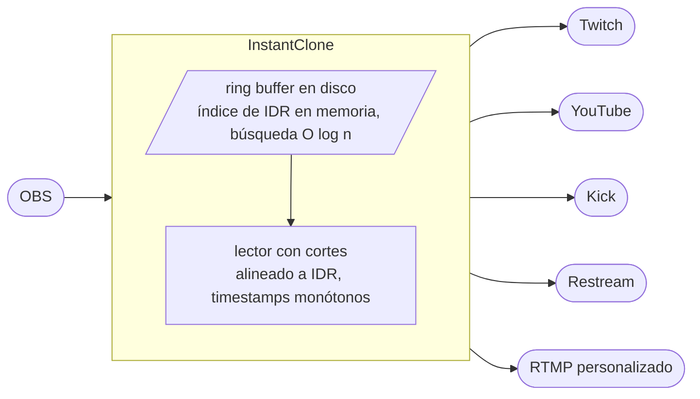

<div align="center">

<sub><a href="README.md">English</a> &nbsp;·&nbsp; <b>Español</b></sub>

<br/>
<br/>


<br/>

<a href="#instalación"></a>
<a href="#cómo-funciona"></a>
<a href="#configuración-de-obs"></a>
<a href="#control-http"></a>

<br/>
<br/>

<a href="https://github.com/Soulhackzlol/InstantClone/actions/workflows/ci.yml"></a>
<a href="https://github.com/Soulhackzlol/InstantClone/releases"></a>
<a href="LICENSE"></a>


</div>

<br/>

<div align="center"></div>

<table>
<tr>
<td valign="top" width="62%">

## Por qué

Quería poner delay en mi propio directo y me puse a buscar. La opción más cuidada que encontré fue [InstantDelay](https://instant-delay.com/), que es de pago. Prefería tener algo que pudiera construir desde cero, entender de punta a punta y adaptar a mi setup, así que escribí esto.

Cuando ya lo tenía hecho, las piezas que de verdad quería eran: una activación en dos fases (para que el momento de salir al aire con delay sea imperceptible en el reproductor del destino), varios destinos simultáneos, un dock para OBS y un overlay de estadísticas que se mete como browser-source.

<sub>InstantClone es un proyecto independiente, sin afiliación ni respaldo de InstantDelay ni de sus desarrolladores.</sub>

</td>
<td valign="top" width="38%">

<table>
<tr><td><b>Binario</b></td><td align="right"><code>1.3 MB</code></td></tr>
<tr><td><b>RSS inactivo</b></td><td align="right"><code>~9 MB</code></td></tr>
<tr><td><b>Hilos</b></td><td align="right"><code>1 tokio + 1 bandeja</code></td></tr>
<tr><td><b>Deps en runtime</b></td><td align="right"><code>tokio, bytes, ureq</code></td></tr>
<tr><td><b>Tests</b></td><td align="right"><code>238 / 238</code></td></tr>
</table>

</td>
</tr>
</table>

<br/>

<div align="center"></div>

## Cómo funciona

<div align="center">

</div>

<br/>

<table>
<tr>
<td valign="top" width="50%">

**Dos fases por diseño.** **Armas** un buffer (tamaño en segundos). InstantClone empieza a rellenarlo desde el feed de OBS sin afectar todavía a lo que sale al aire. Cuando está lleno pasa de <kbd>BUFFERING</kbd> a <kbd>ARMED</kbd> y pulsas **Activar** cuando quieras. La transición es instantánea en pantalla: el lector cambia de la cola en vivo a una posición N segundos atrás.

</td>
<td valign="top" width="50%">

**Cortar es el mismo truco al revés.** Pulsas **Cortar**, el lector busca el IDR más cercano a la cola en vivo, reescribe los timestamps para que sigan siendo monótonos desde donde el reproductor del destino piensa que está el "ahora", y reanuda. Sin reconexión, sin nuevo handshake.

</td>
</tr>
</table>



> [!NOTE]
> El buffer vive en disco por defecto (`./instantclone.buf`, 500 MB ≈ 11 minutos a 6 Mbps, ≈ 6 min 50 s a 10 Mbps), fuera de RAM porque puede llegar a varios cientos de MB. Lo único en RAM es el índice de IDR, alrededor de 1 MB para 10 minutos a 60 fps. El archivo se borra al cerrar la app de forma limpia, así que no se acumula entre sesiones. La UI se niega a armar un delay mayor de lo que el buffer puede aguantar al bitrate actual, con un "necesita ≥ N MB" explícito - sin stalls silenciosos.

<br/>

<div align="center"></div>

## Instalación

```text
1.  Descarga instantclone.exe
2.  Doble clic
3.  El panel se abre en http://127.0.0.1:7799
```

Ya está. Mientras corre se queda un icono en la bandeja del sistema. Clic derecho para abrir el panel, el dock de OBS, un **Cortar delay** al vuelo, o **Quit**. Cerrar la pestaña del navegador no mata el proxy; solo Quit lo hace.

> [!IMPORTANT]
> El Firewall de Windows preguntará en el primer arranque porque el proxy escucha en <kbd>:1935</kbd> (RTMP) y <kbd>:7799</kbd> (web). Permítelo solo en **Redes privadas**.

> [!WARNING]
> Solo Windows 10/11. macOS y Linux no están soportados, no están probados y no están empaquetados.

<br/>

<div align="center"></div>

## Configuración de OBS

<table>
<tr>
<td valign="top" width="58%">

En OBS, ve a **Ajustes → Emisión** y cambia:

```diff
- Servicio:   Twitch (o lo que tuvieras)
- Servidor:   auto
- Stream Key: <tu clave real>
+ Servicio:   Personalizado
+ Servidor:   rtmp://127.0.0.1:1935/live
+ Stream Key: live
```

Pulsa **Iniciar transmisión**. La cápsula OBS de InstantClone se pone verde. Tus claves reales de Twitch/YouTube/Kick van en la pestaña **Destinos** de InstantClone, no en OBS. OBS solo habla con InstantClone.
Seguramente desaparezca tu chat de twitch en OBS porque OBS detecta que no "vas a transmitir en Twitch", añade el panel manualmente.
</td>
<td valign="top" width="42%">

<table>
<tr><td align="center" width="40"><b>1</b></td><td>Pon un delay (p. ej. <kbd>15</kbd>s) → <b>Armar</b>.</td></tr>
<tr><td align="center"><b>2</b></td><td>Mira cómo se llena el buffer. Cuando indique <kbd>ARMED</kbd>, pulsa <b>Activar</b>.</td></tr>
<tr><td align="center"><b>3</b></td><td><b>Cortar delay</b> cuando quieras para volver al directo - o pulsa <b>&#9201; Cortar cuando esto salga</b> justo al acabar tu reacción de fin de partida, e InstantClone corta solo cuando ese momento ha llegado a tus viewers. Sin contar el delay de cabeza.</td></tr>
</table>

> [!TIP]
> Haz fan-out de un único feed de OBS a varios destinos a la vez. Añade Twitch, YouTube y un endpoint RTMP personalizado, activa cada uno por separado y mira su bitrate en vivo por destino. También hay un destino **Local test sink**: InstantClone lanza su propio receptor diminuto en tu PC y emite hacia él, para ensayar armar/activar/cortar de punta a punta - sin stream key, sin que nada salga de tu máquina, y con un enlace **Watch output** que muestra exactamente lo que recibiría una plataforma.

> [!TIP]
> **Vertical gratis.** Activa el **Formato Dual** de Twitch (Enhanced Broadcasting) en OBS y pon el **Formato de stream** de cualquier destino que no sea Twitch en **Vertical**: InstantClone reutiliza el lienzo 9:16 que OBS ya genera para Twitch y lo envía a YouTube Shorts, Kick móvil o cualquier RTMP personalizado, sin codificación extra. El vertical solo fluye mientras el Formato Dual está activo; hasta entonces el destino muestra "Esperando Formato Dual" y nada más se ve afectado. (Twitch gestiona ambos lienzos por su cuenta, así que ahí la opción se oculta.)

</td>
</tr>
</table>

<br/>

<div align="center"></div>

## Dock y overlays

<table>
<tr>
<td valign="top" width="40%">


</td>
<td valign="top" width="60%">

### Dock de OBS

Añade un browser-dock personalizado en OBS apuntando a:

<pre><code>http://127.0.0.1:7799/dock</code></pre>

Un panel de 280×340 con el indicador, los controles de armar/activar/desarmar/cortar y el estado en vivo. Vive dentro de OBS para no cambiar de pestaña en mitad de una partida.

### Overlays como browser-source

La pestaña **Overlay** es un Studio sin código. Elige un overlay ya hecho, copia su URL y métela en OBS - o abre cualquiera en el Studio para rediseñarlo (colores por estado, widgets, animaciones) y darle a **Save** o **Save as new**.

<pre><code>http://127.0.0.1:7799/overlay/whisper.html</code></pre>

<sub><b>¿Sin configurar?</b></sub> &nbsp;Los estilos rápidos de siempre siguen funcionando desde la URL: <code>/overlay?style=corner&amp;lang=es</code> &nbsp;<sub>(`minimal · corner · strip · focus · broadcast · ticker`, idiomas `en · es · pt · fr · de`)</sub>

O suelta cualquier `.html` en `./overlays/` y se sirve en `/overlay/tu-archivo.html`.

</td>
</tr>
</table>

<br/>

<div align="center"></div>

## Control HTTP

<table>
<tr>
<td valign="top" width="62%">

| | Endpoint | Cuerpo | Acción |
|:---|---|---|---|
| <kbd>POST</kbd> | `/arm` | `ms=15000` | Empieza a llenar un buffer de 15 s. No sale al aire todavía. |
| <kbd>POST</kbd> | `/activate` | | Activa el delay armado. <kbd>409</kbd> si el buffer no está listo. |
| <kbd>POST</kbd> | `/disarm` | | Cancela el armado. Descarta el buffer sin salir al aire. |
| <kbd>POST</kbd> | `/stop` | | Corta el delay y vuelve al directo. |
| <kbd>POST</kbd> | `/cut-after` | | Marca el borde en vivo; auto-corta cuando haya salido en todos los destinos (409 si no hay delay activo). |
| <kbd>POST</kbd> | `/cut-after/cancel` | | Descarta un corte programado pendiente sin cortar. |
| <kbd>POST</kbd> | `/delay` | `ms=NNN` | Atajo: arma y activa en cuanto esté listo. |
| <kbd>GET</kbd> | `/state` | | JSON instantáneo del estado. |
| <kbd>GET</kbd> | `/events` | | Flujo SSE del JSON de estado, solo push. |

</td>
<td valign="top" width="38%">

<br/>

**Receta Stream Deck**

La acción **Web Request** habla POST form-encoded por defecto.

```text
URL:    http://127.0.0.1:7799/arm
Método: POST
Cuerpo: ms=15000
```

Armado de un botón. Añade `/activate` y `/stop` a un segundo y tercer botón y tienes control completo del delay desde tu deck.

</td>
</tr>
</table>

<details>
<summary>Respuesta de ejemplo de <code>/state</code></summary>

```json
{
  "phase": "active",
  "armed_delay_ms": 15000,
  "current_delay_ms": 15040,
  "buffer_fill_ms": 15000,
  "ingest_alive": true,
  "egress_alive": true,
  "destinations_alive": 2,
  "destinations_total": 3,
  "bitrate_kbps": 6020,
  "stats": { "tags_sent": 184302, "bytes_sent": 1338294104, "cuts": 1 }
}
```

</details>

<br/>

<div align="center"></div>

## Compilar

Rust 1.74+ estable.

```powershell
git clone <repo>
cd instantclone
cargo build --release
.\target\release\instantclone.exe
```

Sin npm, sin submódulos, sin SDK de plataforma. El HTML del panel se minifica y comprime con gzip en tiempo de compilación desde `build.rs` (usa `flate2`, solo build-dep) y se embebe en el binario; en runtime se sirve con `Content-Encoding: gzip`.

`cargo test --release` cubre la máquina de estados (`arm → preparing → ready → active → cut`), detección de IDR en AVC + Enhanced RTMP, codec AMF0 incluyendo Strict Array (la `fourCcList` de Enhanced-RTMP) + guardia de recursión, round-trip de settings, evicción del ring-buffer con protección de lecturas en vuelo, parsing HTTP, política CSRF, pre-flight de puertos, la negociación de contenido `accepts_gzip`, la caché de cabeceras de secuencia por-pista de Enhanced Broadcasting + selección de tags consciente del TrackId, el audio multi-pista de Enhanced-RTMP (pista de VOD de Twitch), el filtro de IDR de pista primaria para que los cortes con EB no glitcheen las escaleras, el parseo de orientación del SPS para la selección de lienzo vertical (9:16), la resolución de `user.ini` / `global.ini` en OBS 32, el parcheado de `services.json` de OBS, el parser de releases de GitHub + comparador SemVer-ish para el chequeo de actualizaciones, la implementación propia de SHA-256 (vectores NIST), el lector/escritor del flujo de chunks RTMP (cabeceras fmt 0-3, timestamps extendidos, fragmentación entre chunks, control Set-Chunk-Size / Window-Ack en banda, y guardias ante entrada malformada), la máquina de estados del corte programado ("cortar cuando esto salga"), y la descarga + verificación de checksum + intercambio del exe en disco de la auto-actualización. 236 tests, todos en verde.

<br/>

<div align="center"></div>

## Estado

**Listo para uso diario en Windows.** Lo uso en mis propios directos. CI corre fmt + clippy (con `-D warnings`) + 238 tests en cada push, y un tag dispara la build + publicación automática de la release con su `SHA256SUMS.txt` al lado (todavía no hay certificado de firma de código, así que el sistema operativo puede avisar en el primer lanzamiento).

**Lo que está sólido**

- La máquina de estados `arm → activate → cut` en dos fases, con cortes alineados a IDR y reescritura monótona de timestamps. La pieza por la que empecé este proyecto.
- **Ajuste de delay en vivo**: re-armar o cambiar el delay arriba/abajo sin desarmar primero. El backend ya lo soportaba; el panel ahora lo expone como un valor escrito + CTA "↻ Adjust ↑/↓ to Ns".
- **Handshake RTMP a la altura de OBS.** `connect` lleva el mismo paquete de capacidades de códec que envía librtmp (`audioCodecs=3191`, `videoCodecs=252`, `videoFunction=1`), la `fourCcList` de Enhanced-RTMP (AVC / HEVC / AV1 / VP9 / Opus / AC-3 / FLAC), `Set Chunk Size` antes del connect, `FCUnpublish → deleteStream` al cerrar, y Acknowledgement RTMP (BYTES_READ_REPORT) cruzando el umbral window/10 declarado por el peer en ingest y egress.
- **Passthrough de Enhanced Broadcasting a Twitch.** Cuando OBS activa multi-track "Auto" proxyamos la `GetClientConfiguration` de Twitch, enrutamos el egress al endpoint IVS asignado para la sesión, y reenviamos cada SPS/PPS por pista bit a bit para que la escalera transcodificada se ilumine sin depender del tier de la cuenta. Los destinos no-Twitch reciben la pista primaria horizontal por defecto - los tags de escalera multi-track con `TrackId != 0` se descartan para evitar la avalancha de múltiples frames por PTS que rompía el decoder de YouTube. Los cortes con EB aterrizan en el IDR de la pista primaria (no en el de la escalera que toque ganar el partition_point), así el decoder del destino siempre tiene su ancla.
- **Salida vertical (9:16) para destinos que no son Twitch.** Pon el **Formato de stream** de un destino YouTube / Kick / personalizado en **Vertical** y reenviará el lienzo vertical del Formato Dual de Twitch en lugar del horizontal, aplanado a un feed single-track que esas plataformas aceptan de forma nativa (YouTube Shorts, Kick móvil, TikTok). El lienzo vertical se identifica decodificando la orientación del SPS de cada pista (vertical, mayor área) en vez de depender del JSON privado de sesión de Twitch, y se auto-corrige según el Formato Dual se activa/desactiva. Sólo fluye mientras el Formato Dual / Enhanced Broadcasting está activo en OBS; si no, la tarjeta del destino muestra "Esperando Formato Dual" y nada más se ve afectado. Se oculta para Twitch, que lleva ambos lienzos de forma nativa.
- **Pista VOD de Twitch (audio multi-pista).** Toggle por destino. Escribimos `EnableCustomServerVodTrack` en el `user.ini` de OBS 32 (con fallback a `global.ini` en instalaciones antiguas) para desbloquear el checkbox de OBS, y luego reenviamos tanto los tags single-track de Enhanced-RTMP (live, TrackId 0) como los OneTrack multi-track (VOD, TrackId 1) bit a bit a Twitch. El lector de formato de cable coincide byte a byte con el `flv_packet_audio_ex` de OBS (`AudioPacketType` en el byte 0, `TrackId` en el byte 6). Live + VOD funcionan junto con los cortes de delay; para combinarlo con EB usa el botón de un clic **"Set up VOD + EB"** (escribe el flag de desbloqueo, lanza `obs64.exe --config-url <nuestro endpoint>` porque el plugin `rtmp_custom` de OBS descarta cualquier URL inyectada en el `service.json` al cargar, y luego re-verifica con un checklist rojo-a-verde), o genera un **acceso directo de escritorio** que arranca todo el flujo vía `instantclone.exe --launch-eb` (también en la bandeja).
- **Registro de servicio en OBS con un click.** El primer paso del wizard añade una entrada "InstantClone" al desplegable de servicios de OBS (escribe `services.json` con `.bak` previo; se refresca si cambia el puerto; surfacea "cierra OBS primero" cuando el fichero está bloqueado).
- Egress multi-destino con reconexión + bitrate por destino.
- **UI consciente de la capacidad del buffer**: pista en vivo "X MB → máx Ys de delay a N Mbps", se niega a armar un delay mayor de lo que cabe con una razón explícita "necesita ≥ N MB".
- **Avisos por plataforma**: riesgo de fallo de decodificación en móvil por encima de 8 Mbps en Twitch Source-Only, reglas de ingesta AWS IVS de Kick (CBR + keyframe de 2 s; los B-frames en realidad van bien en su RTMP de baja latencia), enlaces directos al dashboard de claves de cada plataforma - todo expuesto en el wizard y el formulario de destino para no aprender cada gotcha en directo.
- Icono de bandeja con estado en vivo + corte de un click, pre-flight de puertos que identifica el proceso conflictivo por PID + exe.
- Cobertura de tests sobre la máquina de estados, detección IDR (AVC + Enhanced RTMP + flatten multi-track), codec AMF0 incluyendo Strict Array, evicción del ring con protección de lecturas en vuelo, y la promoción del wrap de timestamps que evita el bug de los 49,7 días.

**Lo que sigue siendo áspero, siendo honesto**

- **Solo Windows.** macOS / Linux no están probados ni empaquetados. Varios módulos (bandeja, pre-flight de puertos, sampler de RSS) tienen rutas específicas de Windows que necesitarían implementación paralela.
- **Directos de varias horas sin verificar.** El más largo probado en condiciones reales son ~30 minutos. El supervisor + keepalive + acks están diseñados para sesiones indefinidas pero nadie ha estresado una sesión de 8 h aún.
- **I/O de disco sin async en el hot-path** para el append del ring. La page cache lo absorbe a tasas típicas de stream, pero un stall por flush podría congelar otras tareas. `spawn_blocking` está en la lista para v0.2.
- **Un puñado de `unwrap()` sobre locks.** Está bien porque `panic = "abort"` impide que una condición de poison se propague, pero sigue en la lista de limpieza.
- **Servidor HTTP escrito a mano.** Binario más pequeño que con `hyper`, pero ahora me toca cargar con toda la superficie de CVEs HTTP. Vale la pena reevaluarlo si la superficie crece.

> [!WARNING]
> Esto es un proyecto personal que uso yo mismo, no un producto de empresa. Si emites esports pagados, valídalo contra tu propio pipeline antes de confiar en él.

<br/>

<div align="center"></div>

## Contacto

<p>
<a href="https://twitch.tv/s1moscs"></a>
&nbsp;<a href="https://x.com/s1moscs"></a>
&nbsp;<a href="https://youtube.com/@s1moscs"></a>
&nbsp;<a href="https://discord.com/users/s1moscs"></a>
</p>

Sígueme en directo mientras construyo esto, o cuéntame qué tal te va con la app. Bugs y propuestas → [Issues](https://github.com/Soulhackzlol/InstantClone/issues) y [Discussions](https://github.com/Soulhackzlol/InstantClone/discussions).

<br/>

<div align="center"></div>

## Licencia

[GPL-3.0](LICENSE). Puedes usarlo, modificarlo y correrlo en el directo que quieras. Si distribuyes una versión modificada (incluyendo un fork "Pro", un instalador empaquetado con extras o un front-end de pago), tu código fuente tiene que publicarse bajo la misma licencia, en abierto. Construí esto como alternativa gratis porque la quería para mí; la GPL es lo que hace que los forks sigan siendo libres también.

Hecho por [s1moscs](https://s1moscs.dev).
