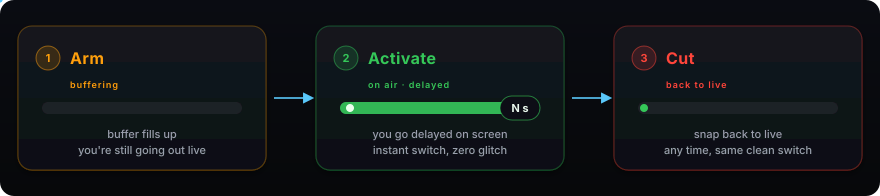
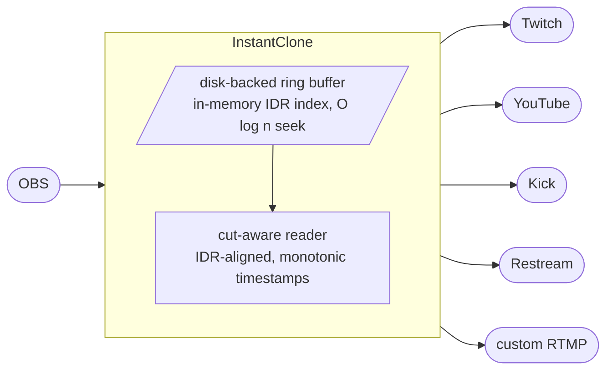

<div align="center">

<sub><b>English</b> &nbsp;·&nbsp; <a href="README.es.md">Español</a></sub>

<br/>
<br/>



<br/>

<a href="#install"></a>
<a href="#how-it-works"></a>
<a href="#obs-setup"></a>
<a href="#http-control"></a>

<br/>
<br/>

<a href="https://github.com/Soulhackzlol/InstantClone/actions/workflows/ci.yml"></a>
<a href="https://github.com/Soulhackzlol/InstantClone/releases"></a>
<a href="LICENSE"></a>


</div>

<br/>

<div align="center"></div>

<table>
<tr>
<td valign="top" width="62%">

## Why

I wanted a delay buffer for my own stream and went looking. The polished option I found was [InstantDelay](https://instant-delay.com/), which is paid. I'd rather have something I could rebuild from scratch, understand end-to-end, and adapt to my setup, so I wrote this instead.

Once it existed, the parts I'd actually wanted ended up in: a real two-phase arm/activate (so the moment you go live with delay is **zero glitch** on the destination player), multiple egress destinations at once, an OBS browser-dock, and a stats overlay you can drop in as a browser-source.

<sub>InstantClone is an independent project, not affiliated with or endorsed by InstantDelay or its developers.</sub>

</td>
<td valign="top" width="38%">

<table>
<tr><td><b>Binary</b></td><td align="right"><code>1.2 MB</code></td></tr>
<tr><td><b>Idle RSS</b></td><td align="right"><code>~9 MB</code></td></tr>
<tr><td><b>Threads</b></td><td align="right"><code>1 tokio + 1 tray</code></td></tr>
<tr><td><b>Runtime deps</b></td><td align="right"><code>tokio, bytes, ureq</code></td></tr>
<tr><td><b>Tests</b></td><td align="right"><code>205 / 205</code></td></tr>
</table>

</td>
</tr>
</table>

<br/>

<div align="center"></div>

## How it works

<div align="center">

</div>

<br/>

<table>
<tr>
<td valign="top" width="50%">

**Two-phase by design.** You **arm** a buffer (target size in seconds). InstantClone pre-fills it from the live OBS feed without affecting what's going out. Once it's full, the state moves from <kbd>BUFFERING</kbd> to <kbd>ARMED</kbd> and you hit **Activate** when you're ready. The transition is instant on screen: the reader just swaps from the live tail to a position N seconds back in the ring.

</td>
<td valign="top" width="50%">

**Cutting is the same trick in reverse.** You hit **Cut**, the reader seeks to the nearest IDR near the live tail, rewrites timestamps so they continue monotonically from where the destination player thinks "now" is, and resumes. No re-handshake, no reconnect, no glitch.

</td>
</tr>
</table>



> [!NOTE]
> The buffer is on disk by default (`./instantclone.buf`, 500 MB ≈ 11 minutes at 6 Mbps, ≈ 6 min 50 s at 10 Mbps), kept off RAM because it can be hundreds of MB. The only thing in RAM is the IDR index, about 1 MB for 10 minutes at 60 fps. The file is reset on every clean shutdown, so it doesn't accumulate between sessions. The UI refuses to arm a delay larger than the buffer can hold at the current bitrate, with an explicit "needs ≥ N MB" reason - no silent stalls.

<br/>

<div align="center"></div>

## Install

```text
1.  Download instantclone.exe
2.  Double-click it
3.  Dashboard opens at http://127.0.0.1:7799
```

That's the whole install. A tray icon sits in the systray while it's running. Right-click it for the dashboard, the OBS dock, a one-click **Cut delay**, or **Quit**. Closing the browser tab doesn't kill the proxy; only Quit does.

> [!IMPORTANT]
> Windows Firewall will prompt on first launch because the proxy listens on <kbd>:1935</kbd> (RTMP) and <kbd>:7799</kbd> (web). Allow it on **Private networks** only.

> [!WARNING]
> Windows 10/11 only. macOS and Linux are not supported, not tested, and not packaged.

<br/>

<div align="center"></div>

## OBS setup

<table>
<tr>
<td valign="top" width="58%">

In OBS, go to **Settings → Stream** and change:

```diff
- Service:    Twitch (or whatever you had)
- Server:     auto
- Stream Key: <your real key>
+ Service:    Custom
+ Server:     rtmp://127.0.0.1:1935/live
+ Stream Key: live
```

Click **Start Streaming**. The OBS pill in InstantClone turns green. Your real Twitch/YouTube/Kick keys go into InstantClone's **Destinations** tab, not OBS. OBS only ever talks to InstantClone.

</td>
<td valign="top" width="42%">

<table>
<tr><td align="center" width="40"><b>1</b></td><td>Type a delay (e.g. <kbd>15</kbd>s) → <b>Arm</b>.</td></tr>
<tr><td align="center"><b>2</b></td><td>Watch the buffer fill. When it says <kbd>ARMED</kbd>, hit <b>Activate</b>.</td></tr>
<tr><td align="center"><b>3</b></td><td><b>Cut delay</b> at any time to snap back to live.</td></tr>
</table>

> [!TIP]
> Fan out one OBS feed to several destinations at once. Add Twitch, YouTube, and a custom RTMP endpoint, toggle each on independently, watch their per-destination bitrate live.

> [!TIP]
> **Go vertical for free.** Turn on Twitch **Dual Format** (Enhanced Broadcasting) in OBS and set any non-Twitch destination's **Stream format** to **Vertical** - InstantClone reuses the 9:16 canvas OBS is already making for Twitch and sends it to YouTube Shorts, Kick mobile, or any custom RTMP target, with no extra encoding. Vertical only flows while Dual Format is on; until then the destination shows "Waiting for Dual Format" and nothing else is affected. (Twitch handles both canvases itself, so the option is hidden there.)

</td>
</tr>
</table>

<br/>

<div align="center"></div>

## Dock and overlays

<table>
<tr>
<td valign="top" width="40%">



</td>
<td valign="top" width="60%">

### OBS browser-dock

Add a custom dock in OBS pointing at:

<pre><code>http://127.0.0.1:7799/dock</code></pre>

A 280×340 panel with the readout, arm / activate / disarm / cut controls, and live status. Lives inside OBS so you're not alt-tabbing mid-match.

### Browser-source overlays

The **Overlay** tab is a no-code Studio. Pick a ready-made overlay, copy its URL, and drop it into OBS - or open any in the Studio to redesign it (per-state colours, widgets, animations) and **Save** or **Save as new**.

<pre><code>http://127.0.0.1:7799/overlay/whisper.html</code></pre>

<sub><b>No setup?</b></sub> &nbsp;The older quick styles still work straight from a URL: <code>/overlay?style=corner&amp;lang=es</code> &nbsp;<sub>(`minimal · corner · strip · focus · broadcast · ticker`, langs `en · es · pt · fr · de`)</sub>

Or drop any `.html` into `./overlays/` and it's served at `/overlay/your-file.html`.

</td>
</tr>
</table>

<br/>

<div align="center"></div>

## HTTP control

<table>
<tr>
<td valign="top" width="62%">

| | Endpoint | Body | What it does |
|:---|---|---|---|
| <kbd>POST</kbd> | `/arm` | `ms=15000` | Start filling a 15 s buffer. Does not go live yet. |
| <kbd>POST</kbd> | `/activate` | | Activate the armed delay. <kbd>409</kbd> if the buffer isn't ready. |
| <kbd>POST</kbd> | `/disarm` | | Cancel arming. Drop the buffer without going live. |
| <kbd>POST</kbd> | `/stop` | | Cut the delay, return to live. |
| <kbd>POST</kbd> | `/delay` | `ms=NNN` | One-shot: arm, auto-activate as soon as ready. |
| <kbd>GET</kbd> | `/state` | | One-shot JSON snapshot. |
| <kbd>GET</kbd> | `/events` | | Server-sent stream of state JSON. Push-only. |

</td>
<td valign="top" width="38%">

<br/>

**Stream Deck recipe**

The **Web Request** action speaks form-encoded POST by default.

```text
URL:    http://127.0.0.1:7799/arm
Method: POST
Body:   ms=15000
```

One-button arming. Add `/activate` and `/stop` to a second and third button and you have full delay control from your deck.

</td>
</tr>
</table>

<details>
<summary>Sample <code>/state</code> response</summary>

```json
{
  "phase": "active",
  "armed_delay_ms": 15000,
  "current_delay_ms": 15040,
  "buffer_fill_ms": 15000,
  "ingest_alive": true,
  "egress_alive": true,
  "destinations_alive": 2,
  "destinations_total": 3,
  "bitrate_kbps": 6020,
  "stats": { "tags_sent": 184302, "bytes_sent": 1338294104, "cuts": 1 }
}
```

</details>

<br/>

<div align="center"></div>

## Build

Rust 1.74+ stable.

```powershell
git clone <repo>
cd instantclone
cargo build --release
.\target\release\instantclone.exe
```

No npm. No submodules. No platform SDKs. The dashboard HTML is minified + gzipped at build time by `build.rs` (uses `flate2`, build-only) and embedded into the binary; at runtime it's served with `Content-Encoding: gzip`.

`cargo test --release` covers the state machine (`arm → preparing → ready → active → cut`), AVC + Enhanced RTMP IDR detection, AMF0 codec including Strict Array (Enhanced-RTMP `fourCcList`) + recursion guard, settings round-trip, ring-buffer eviction with in-flight-read protection, HTTP parsing, CSRF policy, port pre-flight, `accepts_gzip` content negotiation, Enhanced Broadcasting per-track seq-header cache + TrackId-aware tag selection, Enhanced-RTMP multi-track audio (Twitch's VOD audio track), primary-track IDR gate so EB cuts don't pixel-glitch ladder rungs, SPS orientation parsing for vertical-canvas (9:16) selection, OBS 32 `user.ini` / legacy `global.ini` path resolution, the OBS services.json patcher, the GitHub releases update-check parser + SemVer-ish comparator, the hand-rolled SHA-256 (NIST vectors), and the self-update download + checksum-verify + on-disk exe swap. 205 tests, all green.

<br/>

<div align="center"></div>

## Status

**Daily-driver ready on Windows.** I use it on my own streams. CI runs fmt + clippy (with `-D warnings`) + 205 tests on every push, and a tagged commit auto-builds + publishes a release artifact with a `SHA256SUMS.txt` checksum file alongside (no code-signing certificate yet, so the OS may warn on first launch).

**What's solid**

- The two-phase `arm → activate → cut` state machine, with IDR-aligned cuts and monotonic timestamp rewrites. The thing that would have made me build this if it didn't exist.
- **Live delay adjustment**: re-arm or adjust the delay up / down without disarming first. Backend already supported it; the cockpit now exposes it as a single typed-value + "↻ Adjust ↑/↓ to Ns" CTA.
- **Full OBS-parity RTMP handshake.** `connect` carries the same codec-capability bag librtmp ships (`audioCodecs=3191`, `videoCodecs=252`, `videoFunction=1`), the Enhanced-RTMP `fourCcList` (AVC / HEVC / AV1 / VP9 / Opus / AC-3 / FLAC), `Set Chunk Size` before connect, `FCUnpublish → deleteStream` on shutdown, and RTMP Acknowledgement (BYTES_READ_REPORT) at the peer-declared window/10 threshold on both ingest and egress.
- **Enhanced Broadcasting passthrough to Twitch.** When OBS hits multi-track "Auto" we proxy Twitch's `GetClientConfiguration`, route egress to the session-allocated IVS endpoint, and forward every per-track SPS/PPS bit-faithfully so the transcoded ladder lights up regardless of account tier. Non-Twitch destinations get the horizontal primary track by default - multi-track ladder tags with `TrackId != 0` are dropped to avoid the multi-frame-per-PTS storm that crashes YouTube's decoder. EB cuts land on the primary track's IDR (not whichever ladder rung's keyframe happens to win the partition_point) so the destination decoder always has its anchor.
- **Vertical (9:16) output for non-Twitch destinations.** Set a YouTube / Kick / custom destination's **Stream format** to **Vertical** and it forwards Twitch Dual Format's vertical canvas instead of the horizontal one, flattened to a standard single-track feed those platforms accept natively (YouTube Shorts, Kick mobile, TikTok). The vertical canvas is identified by decoding each track's SPS for orientation (portrait, largest area) rather than relying on Twitch's private session JSON, and it self-heals as Dual Format toggles on/off. It only flows while Twitch Dual Format / Enhanced Broadcasting is on in OBS; otherwise the destination card shows "Waiting for Dual Format" and nothing else is affected. Hidden for Twitch, which carries both canvases natively.
- **Twitch VOD audio track (multi-track audio).** Per-destination toggle. We write `EnableCustomServerVodTrack` to OBS 32's `user.ini` (falling back to `global.ini` on older installs) so the OBS gate unlocks, then forward both Enhanced-RTMP single-track (live, TrackId 0) and OneTrack multi-track (VOD, TrackId 1) audio tags bit-faithfully to Twitch. Wire-format reader matches OBS's `flv_packet_audio_ex` byte-for-byte (`AudioPacketType` in byte 0, `TrackId` at byte 6). Live + VOD audio works alongside delay cuts; combine with EB via the one-click **"Set up VOD + EB"** (writes the unlock flag, launches `obs64.exe --config-url <our endpoint>` because OBS's `rtmp_custom` plugin discards file-injected URLs at load time, then re-verifies with a red-to-green checklist), or generate a **desktop shortcut** that cold-starts the whole flow via `instantclone.exe --launch-eb` (also on the tray).
- **One-click OBS service registration.** The wizard's primary onboarding path adds an "InstantClone" entry to OBS's Service dropdown (writes `services.json` with a `.bak` first; refreshes on port change; surfaces "close OBS first" when the file is locked).
- Multi-destination egress with per-destination reconnect + bitrate stats.
- **Capacity-aware buffer UI**: live "X MB → max Ys delay at N Mbps" hint, refuses to arm a delay larger than the buffer can hold with an explicit "needs ≥ N MB" reason.
- **Platform-specific warnings**: Twitch mobile-decoder risk above 8 Mbps under Source-Only, Kick's AWS IVS ingest rules (CBR + 2 s keyframe; B-frames actually fine on its low-latency RTMP), per-platform stream-key dashboard links - all surfaced in the wizard / destination form so streamers don't have to learn each platform's gotchas the hard way.
- Tray icon with live status + one-click cut, port-conflict pre-flight that names the offending process by PID + exe.
- Test coverage covers the state machine, AVC + Enhanced RTMP IDR detection + multi-track flatten, AMF0 codec including Strict Array, ring eviction with in-flight-read protection, and the timestamp-wrap promotion that prevents the 49.7-day bug.

**What's rough, honestly**

- **Windows only.** macOS / Linux aren't tested or packaged. Several modules (tray, port pre-flight, RSS sampler) have Windows-specific code paths that need parallel implementations.
- **Multi-hour streams lightly validated.** Longest single run is ~5 hours, with roughly ~10 hours cumulative across test sessions. The supervisor + keepalive + ack logic is designed to handle indefinite sessions; an 8+ hour daily-driver run still wants more mileage.
- **Transcoded ladder isn't guaranteed without EB.** Only Twitch Partners get a transcode slot every time. Affiliates get one opportunistically (capacity-dependent, and far less likely above ~6 Mbps); everyone else stays Source-Only. Above ~8 Mbps under Source-Only, some viewers' hardware decoders fail with Error #1000. This is Twitch's allocation behaviour, not the proxy: OBS's native Twitch preset auto-caps bitrate to stay transcode-eligible, but the Custom-server path (which InstantClone has to be) skips that cap. For a guaranteed ladder use Enhanced Broadcasting (or the VOD+EB Launch button); otherwise keep bitrate near ~6000 Kbps.
- **Sync disk I/O on the ring-append hot path, by choice.** The buffered write lands in the OS page cache in microseconds and the kernel flushes in the background, so the page cache is already acting as the async buffer, and the index and the bytes advance under one lock so a reader never sees a tag whose bytes aren't on disk yet. The tail risk is a writeback stall under memory or slow-disk pressure, which on the current-thread runtime would briefly freeze egress too, not just ingest. Moving the write off-thread adds per-tag overhead and reopens a write-vs-index consistency window, so it isn't worth it for typical hardware. If low-end disks ever become a priority the real lever is the runtime (separate the disk-blocking ingest from egress), not async writes. A someday-maybe I'll revisit, not a blocker.
- **A handful of `unwrap()` on lock guards.** Fine because `panic = "abort"` means a poison condition can't propagate, but still on the cleanup list.
- **Hand-rolled HTTP server.** Smaller binary than `hyper`, but I now own the entire HTTP CVE surface. Worth re-evaluating if the surface grows.

> [!WARNING]
> This is a hobby project I use myself, not a vendor product. If you stream paid esports, validate it against your own pipeline before trusting it on a tournament night.

<br/>

<div align="center"></div>

## Connect

<p>
<a href="https://twitch.tv/s1moscs"></a>
&nbsp;<a href="https://x.com/s1moscs"></a>
&nbsp;<a href="https://youtube.com/@s1moscs"></a>
&nbsp;<a href="https://discord.com/users/s1moscs"></a>
</p>

Catch me streaming while building this, or just chat about the project. Bug reports and feature ideas → [Issues](https://github.com/Soulhackzlol/InstantClone/issues) and [Discussions](https://github.com/Soulhackzlol/InstantClone/discussions).

<br/>

<div align="center"></div>

## License

[GPL-3.0](LICENSE). You can use it, modify it, run it on whatever stream you like. If you distribute a modified version (including a "Pro" fork, a bundled installer with extras, or a paid front-end), your source has to ship under the same license, publicly. I built this as a free alternative because I wanted one for myself; GPL is what keeps forks free too.

Built by [s1moscs](https://s1moscs.dev).
