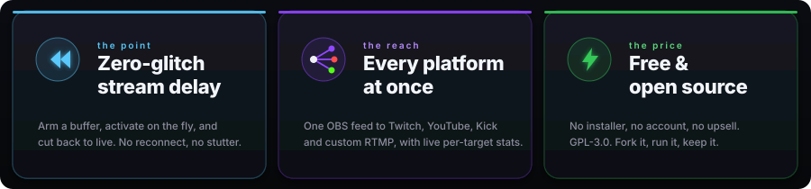

<div align="center">

<sub><b>English</b> &nbsp;·&nbsp; <a href="README.es.md">Español</a></sub>

<br/>
<br/>


<br/>

<a href="https://github.com/Soulhackzlol/InstantClone/releases/latest"></a>


<a href="#quickstart"></a>
<a href="#features"></a>
<a href="#how-it-works"></a>
<a href="#http-control"></a>

<br/>
<br/>

<sub><a href="https://youtu.be/y3aj88gTAOs"><b>▶ Watch the setup tutorial</b></a> &nbsp;·&nbsp; Spanish audio, English subtitles</sub>

<br/>
<br/>

<a href="https://github.com/Soulhackzlol/InstantClone/actions/workflows/ci.yml"></a>
<a href="https://github.com/Soulhackzlol/InstantClone/releases"></a>
<a href="LICENSE"></a>

<a href="https://alternativeto.net/software/instantclone/about/"></a>

</div>

<br/>

<div align="center">

### A zero-glitch stream delay for OBS.

One feed in. A buffered delay you **arm**, **activate**, and **cut** on the fly, fanned out to every platform at once. Free and open source.

</div>

<br/>

<div align="center">

</div>

<br/>

<div align="center"></div>

## Quickstart

<sub>First launch opens a setup wizard that walks you through all of this. The steps below are the same thing by hand.</sub>

<table>
<tr>
<td valign="top" width="50%">

**1 · Run it**

```text
Download instantclone.exe → double-click.
Dashboard opens at http://127.0.0.1:7799
```

That's the whole install. A tray icon sits in the systray while it runs; right-click for the dashboard, dock, one-click **Cut**, or **Quit**. Closing the tab doesn't kill the proxy, only Quit does.

<sub>First launch, Windows SmartScreen may say "unknown publisher" because the build isn't code-signed yet. Click **More info → Run anyway**, or check it against the `SHA256SUMS.txt` on the release.</sub>

</td>
<td valign="top" width="50%">

**2 · Point OBS at it**

Click **Register with OBS** in the dashboard, restart OBS once, then in **Settings → Stream** pick:

```text
Service:  InstantClone
Key:      main          (any string works)
```

Multi-track "Auto" works out of the box. Your real platform keys go into the **Destinations** tab, not OBS.

<sub>Prefer manual? Service <b>Custom</b>, Server <code>rtmp://localhost:1935/live</code>, Key <code>main</code>.</sub>

</td>
</tr>
</table>

**3 · Arm, activate, cut**

<div align="center">

</div>

<table>
<tr><td align="center" width="40"><b>1</b></td><td>Type a delay (e.g. <kbd>15</kbd>s) and hit <b>Arm</b>. The buffer pre-fills from the live feed without touching what's going out.</td></tr>
<tr><td align="center"><b>2</b></td><td>When it reads <code>ARMED</code>, hit <b>Activate</b>. The switch to delayed is instant on screen, no reconnect, no glitch.</td></tr>
<tr><td align="center"><b>3</b></td><td><b>Cut</b> to snap back to live any time, or <b>&#9201; Cut after this airs</b> to auto-cut the moment your reaction reaches viewers. No counting the delay in your head.</td></tr>
</table>

> [!IMPORTANT]
> Windows Firewall prompts on first launch because the proxy listens on <code>:1935</code> (RTMP) and <code>:7799</code> (web). Allow it on **Private networks** only.

> [!NOTE]
> Windows 10/11 and Linux (x86-64) are supported. On Linux it runs headless on a VPS or on an Ubuntu desktop; the browser dashboard is the control surface (there is no native tray). macOS is not supported yet.

<br/>

<div align="center"></div>

## Why

I wanted a delay buffer for my own stream and went looking. The polished option I found was [InstantDelay](https://instant-delay.com/), which is paid. I'd rather have something I could rebuild from scratch, understand end-to-end, and adapt to my setup, so I wrote this instead.

Once it existed, the parts I'd actually wanted ended up in it: a real two-phase arm/activate (so the moment you go live with delay is **zero glitch** on the destination player), multiple egress destinations at once (so it doubles as a free multistream / simulcast tool, a self-hosted alternative to Restream), an OBS browser-dock, and a stats overlay you can drop in as a browser-source.

<sub>InstantClone is an independent project, not affiliated with or endorsed by InstantDelay or its developers.</sub>

<br/>

<div align="center"></div>

## Features

<table>
<tr>
<td valign="top" width="50%">

**🎯 Multistream to every platform**
Simulcast one OBS feed to Twitch, YouTube, Kick, and custom RTMP at once, a free self-hosted alternative to Restream. Toggle each independently, watch per-destination bitrate live. A **Local test sink** streams to a tiny receiver on your PC so you can rehearse arm/activate/cut with no key and nothing leaving your machine.

</td>
<td valign="top" width="50%">

**⏱ Scheduled safe cut**
**Cut after this airs** marks the live edge and auto-cuts once it has reached viewers on every destination. Perfect for match-end reactions without doing delay math in your head.

</td>
</tr>
<tr>
<td valign="top">

**📱 Vertical (9:16) for free**
Turn on Twitch **Dual Format** (Enhanced Broadcasting) and set any non-Twitch destination's format to **Vertical**. InstantClone reuses the 9:16 canvas OBS already makes for Twitch and sends it to YouTube Shorts, Kick mobile, or TikTok, with no extra encoding.

</td>
<td valign="top">

**🎚 VOD audio + copyright-safe routing**
Keep music live but out of the recording. One click adds a second audio track (via a bundled OBS script); then per destination pick an **Audio track**, Twitch keeps **Both**, send the clean **Track 2** to YouTube to dodge copyright, or **Track 1** to Kick.

</td>
</tr>
<tr>
<td valign="top">

**📡 Enhanced Broadcasting passthrough**
When OBS goes multi-track "Auto", InstantClone proxies Twitch's config, routes to the session IVS endpoint, and forwards every per-track SPS/PPS bit-faithfully so the transcode ladder lights up. Non-Twitch destinations get a clean flattened single track.

</td>
<td valign="top">

**🔒 RTMPS egress (Kick + any `rtmps://`)**
The egress socket upgrades to TLS for `rtmps://` URLs, reusing the Windows schannel already linked, so no second TLS stack. Kick is a paste-your-Server-URL platform in the wizard, with the `/app` path added automatically.

</td>
</tr>
<tr>
<td valign="top">

**🎛 OBS dock + no-code overlays**
A 280×340 control dock lives inside OBS so you're not alt-tabbing mid-match. The **Overlay** tab is a Studio: pick a ready-made stats overlay, copy its URL, drop it into OBS as a browser-source, or redesign it live.

</td>
<td valign="top">

**⚡ Live delay adjustment**
Re-arm or nudge the delay up/down without disarming first, exposed as a single typed-value **↻ Adjust to Ns** control. Capacity-aware: it refuses a delay the buffer can't hold and tells you exactly how many MB it needs.

</td>
</tr>
<tr>
<td valign="top">

**⌨ Global hotkeys**
Bind delay on/off, arm, activate, cut, and **cut after this airs** to a key combo that fires while a fullscreen game holds focus. Every binding needs a modifier so nothing trips mid-match, a combo another app already owns is flagged on the row instead of failing silently, and a refused action reaches you as a tray balloon.

</td>
<td valign="top">

**🎹 MIDI pads and decks**
Map the same five actions to a pad or knob, learned by pressing the control rather than typing a note number. Each mapping remembers which device it came from, so two controllers can drive different actions even when they send the same note, and you can narrow which device InstantClone listens to.

</td>
</tr>
</table>

> [!TIP]
> **One-click OBS registration.** The setup wizard can add an "InstantClone" entry to OBS's Service dropdown for you (writes `services.json` with a `.bak` first, refreshes on port change, and warns "close OBS first" when the file is locked).

<br/>

<div align="center"></div>

## How it works

<table>
<tr>
<td valign="top" width="50%">

**Two-phase by design.** You **arm** a buffer (a target size in seconds). InstantClone pre-fills it from the live OBS feed without touching what's going out. Once it's full you hit **Activate**, and the switch to delayed is instant on screen: the player just jumps from the live edge to a point N seconds back.

</td>
<td valign="top" width="50%">

**Cutting is the same trick in reverse.** You hit **Cut**, InstantClone lines up on the nearest keyframe near the live edge, fixes the timestamps so they keep counting forward smoothly, and resumes. No reconnect, no black frame, no glitch.

</td>
</tr>
</table>

> [!NOTE]
> The delay buffer lives on disk and resets every time you close the app, so nothing piles up between sessions. Ask for more delay than it can hold and the app tells you exactly what it needs instead of stalling.

<br/>

<div align="center"></div>

## HTTP control

<table>
<tr>
<td valign="top" width="62%">

| | Endpoint | Body | What it does |
|:---|---|---|---|
| <kbd>POST</kbd> | `/arm` | `ms=15000` | Start filling a 15 s buffer. Not live yet. |
| <kbd>POST</kbd> | `/activate` | | Activate the armed delay. <code>409</code> if not ready. |
| <kbd>POST</kbd> | `/disarm` | | Cancel arming, drop the buffer without going live. |
| <kbd>POST</kbd> | `/stop` | | Cut back to live (same as the **Cut** button). |
| <kbd>POST</kbd> | `/cut-after` | | Mark the live edge; auto-cut once it airs everywhere. |
| <kbd>POST</kbd> | `/cut-after/cancel` | | Drop a pending scheduled cut. |
| <kbd>POST</kbd> | `/delay` | `ms=NNN` | One-shot: arm, auto-activate as soon as ready. |
| <kbd>GET</kbd> | `/state` | | One-shot JSON snapshot. |
| <kbd>GET</kbd> | `/events` | | Server-sent stream of state JSON. Push-only. |

</td>
<td valign="top" width="38%">

<br/>

**Stream Deck recipe**

The **Web Request** action speaks form-encoded POST by default.

```text
URL:    http://127.0.0.1:7799/arm
Method: POST
Body:   ms=15000
```

One-button arming. Add `/activate` and `/stop` to two more buttons for full delay control from your deck.

</td>
</tr>
</table>

<details>
<summary>Sample <code>/state</code> response</summary>

```json
{
  "phase": "active",
  "armed_delay_ms": 15000,
  "current_delay_ms": 15040,
  "buffer_fill_ms": 15000,
  "ingest_alive": true,
  "egress_alive": true,
  "destinations_alive": 2,
  "destinations_total": 3,
  "bitrate_kbps": 6020,
  "stats": { "tags_sent": 184302, "bytes_sent": 1338294104, "cuts": 1 }
}
```

</details>

<br/>

<div align="center"></div>

## Under the hood

<details>
<summary><b>RTMP + Enhanced Broadcasting internals</b></summary>

<br/>

- **Full OBS-parity RTMP handshake.** `connect` carries the same codec-capability bag librtmp ships (`audioCodecs=3191`, `videoCodecs=252`, `videoFunction=1`), the Enhanced-RTMP `fourCcList` (AVC / HEVC / AV1 / VP9 / Opus / AC-3 / FLAC), `Set Chunk Size` before connect, `FCUnpublish → deleteStream` on shutdown, and RTMP Acknowledgement (BYTES_READ_REPORT) at the peer-declared window/10 threshold on both ingest and egress.
- **Enhanced Broadcasting passthrough to Twitch.** When OBS hits multi-track "Auto" we proxy Twitch's `GetClientConfiguration`, route egress to the session-allocated IVS endpoint, and forward every per-track SPS/PPS bit-faithfully so the transcoded ladder lights up regardless of account tier. Non-Twitch destinations get the horizontal primary track by default; ladder tags with `TrackId != 0` are dropped to avoid the multi-frame-per-PTS storm that crashes YouTube's decoder. EB cuts land on the primary track's IDR (not whichever ladder rung's keyframe wins the `partition_point`) so the destination decoder always has its anchor.
- **Vertical (9:16) canvas selection.** The vertical canvas is identified by decoding each track's SPS for orientation (portrait, largest area) rather than trusting Twitch's private session JSON, and it self-heals as Dual Format toggles on/off.
- **Twitch VOD audio, unlocked on the InstantClone service.** OBS hardcodes its VOD Track to the service literally named "Twitch" (`ServiceSupportsVodTrack == {"Twitch"}`), so it's locked on the InstantClone service. A tiny bundled OBS script (`optional-vod-unlocker.lua`, downloaded from the dashboard) attaches the same second audio encoder OBS's own VOD Track would, without the gate. Its wire-format reader matches OBS's `flv_packet_audio_ex` byte-for-byte (`AudioPacketType` in byte 0, `TrackId` at byte 6). OBS 32.2+ needs the script; older OBS can still use the built-in VOD Track checkbox (we write `EnableCustomServerVodTrack` to OBS 32's `user.ini`, falling back to `global.ini`).
- **Per-destination audio routing.** Non-selected tracks are dropped and the chosen one is flattened to a standard single-track tag (AAC rewritten to legacy `0xAF`), mirroring the video-side `flatten_multitrack_video`. If the chosen track isn't being sent, it falls back to the live track rather than going silent.

</details>

<details>
<summary><b>Buffer, build, and test coverage</b></summary>

<br/>

<table>
<tr><td><b>Idle RSS</b></td><td align="right"><code>~9 MB</code></td><td width="24"></td><td><b>Threads</b></td><td align="right"><code>1 tokio + 1 tray</code></td><td width="24"></td><td><b>Runtime deps</b></td><td align="right"><code>tokio, bytes, ureq</code></td><td width="24"></td><td><b>Tests</b></td><td align="right"><code>387 / 387</code></td></tr>
</table>

**Buffer.** Disk-backed by default (`./instantclone.buf`, 500 MB ≈ 11 min at 6 Mbps, ≈ 6 min 50 s at 10 Mbps), kept off RAM because it can run to hundreds of MB. The only thing in RAM is the IDR index, ~1 MB for 10 minutes at 60 fps. The file resets on every clean shutdown, so nothing accumulates between sessions, and the UI refuses to arm a delay larger than the buffer can hold, with an explicit "needs ≥ N MB" reason.

**Build.** Rust 1.74+ stable. No npm, no submodules, no platform SDKs.

```powershell
git clone <repo>
cd instantclone
cargo build --release
.\target\release\instantclone.exe
```

The dashboard HTML is minified + gzipped at build time by `build.rs` (`flate2`, build-only) and embedded into the binary; at runtime it's served with `Content-Encoding: gzip`. The optional VOD-unlocker OBS script is embedded too and handed to the browser as a Save-As download, so it always matches the running binary and needs no network.

**Sync disk I/O on the ring-append hot path, by choice.** The buffered write lands in the OS page cache in microseconds and the kernel flushes in the background, so the page cache is already the async buffer; the index and the bytes advance under one lock so a reader never sees a tag whose bytes aren't on disk yet.

**Tests.** `cargo test --release` covers the state machine (`arm → preparing → ready → active → cut`), AVC + Enhanced-RTMP IDR detection, AMF0 (including Strict Array + recursion guard), settings round-trip, ring-buffer eviction with in-flight-read protection, HTTP parsing, CSRF policy, port pre-flight, content negotiation, Enhanced Broadcasting per-track seq-header cache + TrackId-aware tag selection, multi-track audio + per-destination routing, SPS orientation parsing for vertical selection, the OBS `services.json` patcher, the update-check parser, the hand-rolled SHA-256 (NIST vectors), the RTMP chunk-stream reader/writer, the scheduled safe-cut state machine, the hotkey and MIDI binding tables (including the device that tells two controllers apart), and the self-update download + checksum-verify + exe swap. **387 tests, all green.**

</details>

<br/>

<div align="center"></div>

## Status

**Daily-driver ready on Windows.** I use it on my own streams, and a growing group of streamers now run it daily too. CI runs fmt + clippy (`-D warnings`) + 387 tests on every push, and a tagged commit auto-builds and publishes a release with a `SHA256SUMS.txt` alongside (no code-signing certificate yet, so the OS may warn on first launch).

**What's rough, honestly**

- **No native tray on Linux.** Windows has a system-tray icon; on Linux the control surface is the web dashboard (Quit and Restart live in its System tab). macOS isn't supported yet.
- **Transcoded ladder isn't guaranteed without EB.** Only Twitch Partners get a transcode slot every time; everyone else stays Source-Only, where some hardware decoders fail above ~8 Mbps (Twitch's allocation behaviour, not the proxy). For a guaranteed ladder use Enhanced Broadcasting; otherwise keep bitrate near ~6000 Kbps.
- **Hand-rolled HTTP server.** Smaller binary than `hyper`, but I own the entire HTTP surface. Worth re-evaluating if it grows.

> [!WARNING]
> This is a hobby project I use myself, not a vendor product. If you stream paid esports, validate it against your own pipeline before trusting it on a tournament night.

<br/>

<div align="center"></div>

## FAQ

<details>
<summary><b>Does streaming to several platforms lower my quality?</b></summary>

<br/>

No. InstantClone forwards the exact encoded feed from OBS to each destination without re-encoding, so every platform gets the same quality OBS produced. What it does use is **upload bandwidth**: each destination receives the full bitrate, so three destinations need roughly three times the upload. The dashboard shows an "Upload bottleneck" warning and suggests keeping your OBS bitrate under ~80% of your upload.

</details>

<details>
<summary><b>Is the delay applied to every platform at once?</b></summary>

<br/>

Yes. The buffer sits before the fan-out, so every destination plays from the same delayed position. Arm, activate, and cut affect all of them together.

</details>

<details>
<summary><b>How much delay can I set?</b></summary>

<br/>

As much as the buffer holds. The default 500 MB file is about 11 minutes at 6 Mbps (less at higher bitrates). You can make it bigger; the dashboard refuses a delay the buffer can't hold and tells you exactly how many MB it needs, so it never stalls silently.

</details>

<details>
<summary><b>Does it re-encode or touch my video?</b></summary>

<br/>

No. Video is passed through bit-for-bit. The only rewriting happens on the audio container when you route a specific track to a destination (AAC is rewritten to the legacy tag every ingest accepts); the audio samples themselves are untouched.

</details>

<details>
<summary><b>Where do my real stream keys go?</b></summary>

<br/>

In InstantClone's **Destinations** tab, never in OBS. OBS only ever points at InstantClone with one service and a throwaway key; InstantClone holds each platform's real key and fans your feed out to them. So your keys live in one place, and you toggle destinations on and off without touching OBS.

**Your keys never leave your PC.** InstantClone has no servers of its own and no telemetry: keys are stored locally on your machine and only ever sent to the platform ingest servers you choose to stream to. Running the app sends us nothing, we never see your keys, your stream, or anything else. It's open source, so you can verify that yourself.

</details>

<details>
<summary><b>Can I control the delay with a hotkey or a MIDI controller?</b></summary>

<br/>

Yes, both. Five actions - delay on/off, arm, activate, cut to live, and **cut after this airs** - bind to a global keyboard shortcut, a MIDI pad or knob, or both at once, in **Settings**. Hotkeys fire while a fullscreen game holds focus, so you never alt-tab mid-match, and every binding needs a modifier (Ctrl, Alt, Shift or Win) so a stray keypress can't trip a delay action. MIDI mappings are learned by pressing the control rather than typing a note number, and each one remembers which device it came from, so two controllers can drive different actions. Windows only for now.

</details>

<details>
<summary><b>Does it run on macOS or Linux?</b></summary>

<br/>

Windows 10/11 and **Linux (x86-64)** both run it. On Linux it works headless on a VPS or on an Ubuntu desktop, driven by the browser dashboard (there is no native tray, so Quit and Restart live in the dashboard's System tab). For a network-exposed setup, turn on the optional dashboard password and pair it with TLS via a reverse proxy. macOS isn't supported yet.

</details>

<br/>

<div align="center"></div>

## Connect

<p>
<a href="https://twitch.tv/s1moscs"></a>
&nbsp;<a href="https://x.com/s1moscs"></a>
&nbsp;<a href="https://youtube.com/@s1moscs"></a>
&nbsp;<a href="https://discord.com/users/s1moscs"></a>
</p>

Catch me streaming while building this, or just chat about the project. Bug reports and feature ideas → [Issues](https://github.com/Soulhackzlol/InstantClone/issues) and [Discussions](https://github.com/Soulhackzlol/InstantClone/discussions).

<br/>

<div align="center"></div>

## License

[GPL-3.0](LICENSE). Use it, modify it, run it on whatever stream you like. If you distribute a modified version (including a "Pro" fork, a bundled installer, or a paid front-end), your source has to ship under the same license, publicly. I built this as a free alternative because I wanted one for myself; GPL is what keeps forks free too.

Built by [s1moscs](https://s1moscs.dev).
