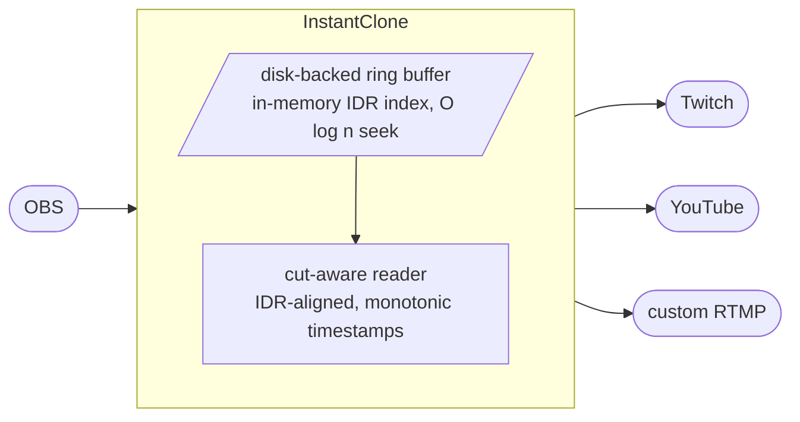

<div align="center">

<sub><b>English</b> &nbsp;·&nbsp; <a href="README.es.md">Español</a></sub>

<br/>
<br/>


<br/>

<a href="#install"></a>
<a href="#how-it-works"></a>
<a href="#obs-setup"></a>
<a href="#http-control"></a>

<br/>
<br/>

<a href="https://github.com/Soulhackzlol/InstantClone/actions/workflows/ci.yml"></a>
<a href="https://github.com/Soulhackzlol/InstantClone/releases/latest"></a>
<a href="LICENSE"></a>


</div>

<br/>

<div align="center"></div>

<table>
<tr>
<td valign="top" width="62%">

## Why

I wanted a delay buffer for my own stream and went looking. The polished option I found was [InstantDelay](https://instant-delay.com/), which is paid. I'd rather have something I could rebuild from scratch, understand end-to-end, and adapt to my setup, so I wrote this instead.

Once it existed, the parts I'd actually wanted ended up in: a real two-phase arm/activate (so the moment you go live with delay is **zero glitch** on the destination player), multiple egress destinations at once, an OBS browser-dock, and a stats overlay you can drop in as a browser-source.

<sub>InstantClone is an independent project, not affiliated with or endorsed by InstantDelay or its developers.</sub>

</td>
<td valign="top" width="38%">

<table>
<tr><td><b>Binary</b></td><td align="right"><code>1.2 MB</code></td></tr>
<tr><td><b>Idle RSS</b></td><td align="right"><code>~9 MB</code></td></tr>
<tr><td><b>Threads</b></td><td align="right"><code>1 tokio + 1 tray</code></td></tr>
<tr><td><b>Runtime deps</b></td><td align="right"><code>tokio, bytes, ureq</code></td></tr>
<tr><td><b>Tests</b></td><td align="right"><code>86 / 86</code></td></tr>
</table>

</td>
</tr>
</table>

<br/>

<div align="center"></div>

## How it works

<div align="center">

</div>

<br/>

<table>
<tr>
<td valign="top" width="50%">

**Two-phase by design.** You **arm** a buffer (target size in seconds). InstantClone pre-fills it from the live OBS feed without affecting what's going out. Once it's full, the state moves from <kbd>BUFFERING</kbd> to <kbd>ARMED</kbd> and you hit **Activate** when you're ready. The transition is instant on screen: the reader just swaps from the live tail to a position N seconds back in the ring.

</td>
<td valign="top" width="50%">

**Cutting is the same trick in reverse.** You hit **Cut**, the reader seeks to the nearest IDR near the live tail, rewrites timestamps so they continue monotonically from where the destination player thinks "now" is, and resumes. No re-handshake, no reconnect, no glitch.

</td>
</tr>
</table>



> [!NOTE]
> The buffer is on disk by default (`./instantclone.buf`, 300 MB ≈ 7 minutes at 6 Mbps), kept off RAM because it can be hundreds of MB. The only thing in RAM is the IDR index, about 1 MB for 10 minutes at 60 fps. The file is reset on every clean shutdown, so it doesn't accumulate between sessions.

<br/>

<div align="center"></div>

## Install

```text
1.  Download instantclone.exe
2.  Double-click it
3.  Dashboard opens at http://127.0.0.1:7799
```

That's the whole install. A tray icon sits in the systray while it's running. Right-click it for the dashboard, the OBS dock, a one-click **Cut delay**, or **Quit**. Closing the browser tab doesn't kill the proxy; only Quit does.

> [!IMPORTANT]
> Windows Firewall will prompt on first launch because the proxy listens on <kbd>:1935</kbd> (RTMP) and <kbd>:7799</kbd> (web). Allow it on **Private networks** only.

> [!WARNING]
> Windows 10/11 only. macOS and Linux are not supported, not tested, and not packaged.

<br/>

<div align="center"></div>

## OBS setup

<table>
<tr>
<td valign="top" width="58%">

In OBS, go to **Settings → Stream** and change:

```diff
- Service:    Twitch (or whatever you had)
- Server:     auto
- Stream Key: <your real key>
+ Service:    Custom
+ Server:     rtmp://127.0.0.1:1935/live
+ Stream Key: live
```

Click **Start Streaming**. The OBS pill in InstantClone turns green. Your real Twitch/YouTube/Kick keys go into InstantClone's **Destinations** tab, not OBS. OBS only ever talks to InstantClone.

</td>
<td valign="top" width="42%">

<table>
<tr><td align="center" width="40"><b>1</b></td><td>Type a delay (e.g. <kbd>15</kbd>s) → <b>Arm</b>.</td></tr>
<tr><td align="center"><b>2</b></td><td>Watch the buffer fill. When it says <kbd>ARMED</kbd>, hit <b>Activate</b>.</td></tr>
<tr><td align="center"><b>3</b></td><td><b>Cut delay</b> at any time to snap back to live.</td></tr>
</table>

> [!TIP]
> Fan out one OBS feed to several destinations at once. Add Twitch, YouTube, and a custom RTMP endpoint, toggle each on independently, watch their per-destination bitrate live.

</td>
</tr>
</table>

<br/>

<div align="center"></div>

## Dock and overlays

<table>
<tr>
<td valign="top" width="40%">


</td>
<td valign="top" width="60%">

### OBS browser-dock

Add a custom dock in OBS pointing at:

<pre><code>http://127.0.0.1:7799/dock</code></pre>

A 280×340 panel with the readout, arm / activate / disarm / cut controls, and live status. Lives inside OBS so you're not alt-tabbing mid-match.

### Browser-source overlays

Drop one in as a browser-source for an on-stream readout:

<pre><code>http://127.0.0.1:7799/overlay?style=corner&amp;lang=es</code></pre>

<sub><b>Styles</b></sub> &nbsp;`minimal` · `corner` · `strip` · `compact` · `focus` · `broadcast` · `stats` · `ticker` · `esports`

<sub><b>Languages</b></sub> &nbsp;`en` · `es` · `pt` · `fr` · `de`

Drop any `.html` into `./overlays/` and it's served at `/overlay/your-file.html`.

</td>
</tr>
</table>

<br/>

<div align="center"></div>

## HTTP control

<table>
<tr>
<td valign="top" width="62%">

| | Endpoint | Body | What it does |
|:---|---|---|---|
| <kbd>POST</kbd> | `/arm` | `ms=15000` | Start filling a 15 s buffer. Does not go live yet. |
| <kbd>POST</kbd> | `/activate` | | Activate the armed delay. <kbd>409</kbd> if the buffer isn't ready. |
| <kbd>POST</kbd> | `/disarm` | | Cancel arming. Drop the buffer without going live. |
| <kbd>POST</kbd> | `/stop` | | Cut the delay, return to live. |
| <kbd>POST</kbd> | `/delay` | `ms=NNN` | One-shot: arm, auto-activate as soon as ready. |
| <kbd>GET</kbd> | `/state` | | One-shot JSON snapshot. |
| <kbd>GET</kbd> | `/events` | | Server-sent stream of state JSON. Push-only. |

</td>
<td valign="top" width="38%">

<br/>

**Stream Deck recipe**

The **Web Request** action speaks form-encoded POST by default.

```text
URL:    http://127.0.0.1:7799/arm
Method: POST
Body:   ms=15000
```

One-button arming. Add `/activate` and `/stop` to a second and third button and you have full delay control from your deck.

</td>
</tr>
</table>

<details>
<summary>Sample <code>/state</code> response</summary>

```json
{
  "phase": "active",
  "armed_delay_ms": 15000,
  "current_delay_ms": 15040,
  "buffer_fill_ms": 15000,
  "ingest_alive": true,
  "egress_alive": true,
  "destinations_alive": 2,
  "destinations_total": 3,
  "bitrate_kbps": 6020,
  "stats": { "tags_sent": 184302, "bytes_sent": 1338294104, "cuts": 1 }
}
```

</details>

<br/>

<div align="center"></div>

## Build

Rust 1.74+ stable.

```powershell
git clone <repo>
cd instantclone
cargo build --release
.\target\release\instantclone.exe
```

No npm. No submodules. No platform SDKs. The dashboard HTML is minified + gzipped at build time by `build.rs` (uses `flate2`, build-only) and embedded into the binary; at runtime it's served with `Content-Encoding: gzip`.

`cargo test --release` covers the state machine (`arm → preparing → ready → active → cut`), AVC + Enhanced RTMP IDR detection, AMF0 codec + recursion guard, settings round-trip, ring-buffer eviction with in-flight-read protection, HTTP parsing, CSRF policy, port pre-flight, and `accepts_gzip` content negotiation. 73 tests, all green.

<br/>

<div align="center"></div>

## Status

**Daily-driver ready on Windows.** I use it on my own streams. CI runs fmt + clippy (with `-D warnings`) + 86 tests on every push, and a tagged commit auto-builds + publishes a signed release artifact.

**What's solid**

- The two-phase `arm → activate → cut` state machine, with IDR-aligned cuts and monotonic timestamp rewrites. The thing that would have made me build this if it didn't exist.
- Multi-destination egress with per-destination reconnect + bitrate stats.
- Tray icon with live status + one-click cut, port-conflict pre-flight that names the offending process by PID + exe.
- Test coverage covers the state machine, AVC + Enhanced RTMP IDR detection, AMF0 codec, ring eviction with in-flight-read protection, and the timestamp-wrap promotion that prevents the 49.7-day bug.

**What's rough, honestly**

- **Windows only.** macOS / Linux aren't tested or packaged. Several modules (tray, port pre-flight, RSS sampler) have Windows-specific code paths that need parallel implementations.
- **Sync disk I/O on the async hot path** for ring append. Page cache absorbs it at typical stream rates, but a flush stall could freeze other tasks. `spawn_blocking` is on the v0.2 list.
- **A handful of `unwrap()` on lock guards.** Fine because `panic = "abort"` means a poison condition can't propagate, but still on the cleanup list.
- **Hand-rolled HTTP server.** Smaller binary than `hyper`, but I now own the entire HTTP CVE surface. Worth re-evaluating if the surface grows.

> [!WARNING]
> This is a hobby project I use myself, not a vendor product. If you stream paid esports, validate it against your own pipeline before trusting it on a tournament night.

<br/>

<div align="center"></div>

## License

[GPL-3.0](LICENSE). You can use it, modify it, run it on whatever stream you like. If you distribute a modified version (including a "Pro" fork, a bundled installer with extras, or a paid front-end), your source has to ship under the same license, publicly. I built this as a free alternative because I wanted one for myself; GPL is what keeps forks free too.

Built by [s1moscs](https://s1moscs.dev).
